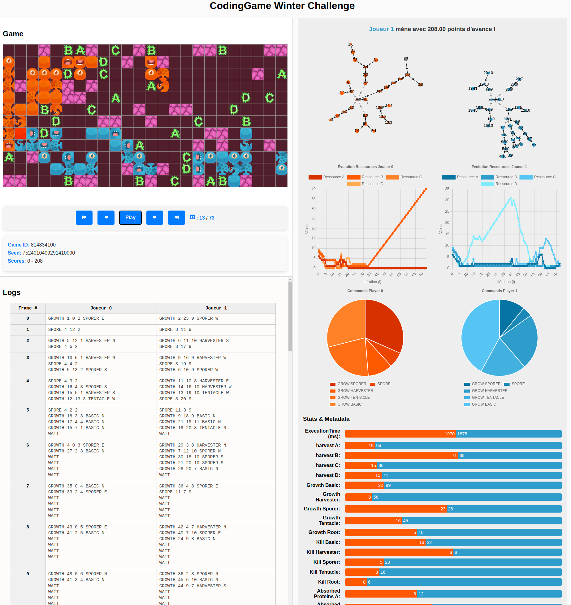

# CGWC2024_Battle_Analyse



Bienvenue sur **CGWC2024_Battle_Analyse**, un projet Node.js permettant d’analyser les données d’un battle pour l’événement CodingGame Winter Challenge 2024.

## Prérequis

- [Node.js](https://nodejs.org/) (version 14+ recommandée)
- [npm](https://www.npmjs.com/) ou [yarn](https://yarnpkg.com/)

## Installation

1. **Cloner le dépôt** :
   ```bash
   git clone https://github.com/D420D4/CGWC2024_Battle_Analyse
   ```
2. **Se positionner dans le dossier du projet** :
   ```bash
   cd CGWC2024_Battle_Analyse
   ```
3. **Installer les dépendances** :
   ```bash
   npm install
   ```


## Lancement du projet

- **Démarrer le serveur** :
  ```bash
  npm start
  ```

Le serveur se lancera par défaut sur le port **3000**.  
Pour accéder à l’application, ouvrez votre navigateur et rendez-vous à l’adresse suivante :
```
http://localhost:3000
```

---

*Merci d’utiliser **CGWC2024_Battle_Analyse** !*  
*Pour toute suggestion ou contribution, n’hésitez pas à ouvrir une issue ou à soumettre une pull request.*
